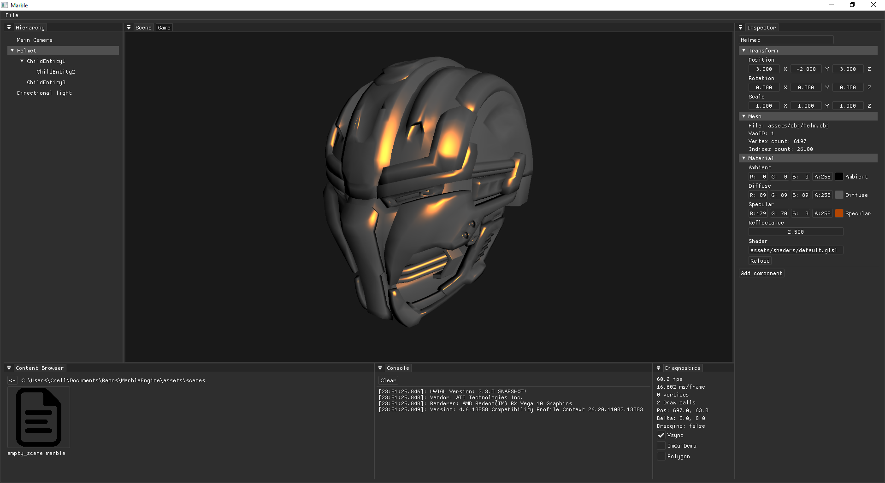
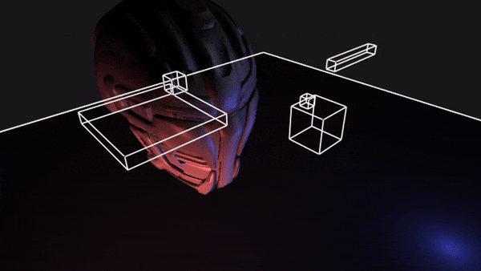

<div id="top"></div>

[![Contributors][contributors-shield]][contributors-url]
[![Forks][forks-shield]][forks-url]
[![Stargazers][stars-shield]][stars-url]
[![Issues][issues-shield]][issues-url]
[![MIT License][license-shield]][license-url]
[![LinkedIn][linkedin-shield]][linkedin-url]


<!-- PROJECT LOGO -->
<br />
<div align="center">
  <a href="https://github.com/chrkj/Marble">
    
  </a>

<h3 align="center">Marble</h3>

  <p align="center">
    A game engine made in Java
    <br />
    <br />
    <a href="https://github.com/chrkj/Marble/issues">Report Bug</a>
    ·
    <a href="https://github.com/chrkj/Marble/issues">Request Feature</a>
  </p>
</div>

<!-- ABOUT THE PROJECT -->
## About The Project
I created this project to learn about 2D/3D rendering by programming a simple game engine using the
[OpenGL](https://www.opengl.org//) rendering API. The engine features a dockable editor with separate scene and
game viewports, play/stop scene simulation, PhysX-driven physics, scene serialization, shadow mapping and entity
behaviour through Java scripts that are compiled and hot-loaded at runtime.

<div align="center">
  <a href="https://github.com/chrkj/Marble">
    
  </a>
</div>

<p align="right">(<a href="#top">back to top</a>)</p>

### Built With

Frameworks/libraries used for the project:

* [LWJGL](https://github.com/LWJGL/lwjgl3)
* [JOML](https://github.com/JOML-CI/JOML)
* [ImGui](https://github.com/SpaiR/imgui-java)
* [Obj](https://github.com/javagl/Obj)
* [JacksonYaml](https://github.com/FasterXML/jackson-dataformat-yaml)
* [PhysX](https://github.com/fabmax/physx-jni)

<p align="right">(<a href="#top">back to top</a>)</p>

<!-- GETTING STARTED -->
## Getting Started

### Prerequisites

* Windows (the build is configured with Windows natives for LWJGL and PhysX)
* JDK 16 (the project uses Gradle 7.0, which supports up to Java 16)

### Build and run

```sh
git clone https://github.com/chrkj/Marble.git
cd Marble
gradlew shadowJar
java -jar build/libs/Marble-1.0-all.jar
```

<p align="right">(<a href="#top">back to top</a>)</p>

<!-- EDITOR CONTROLS -->
## Editor Controls

| Input | Action |
|-------|--------|
| Hold right mouse in the Scene view | Fly camera (move the mouse to look around) |
| `W` / `A` / `S` / `D` | Move camera (while flying) |
| `Q` / `E` | Move camera vertically (while flying) |
| `T` / `R` / `S` | Switch gizmo to translate / rotate / scale |
| Left click | Select entity |

Press the play button in the toolbar to start the scene simulation and the stop button to return to editing.
Scenes can be saved from the `File` menu and opened by dragging a `.marble` file from the Content Browser
into the Scene view.

<p align="right">(<a href="#top">back to top</a>)</p>

<!-- ROADMAP -->
## Roadmap

- ✅ 2D/3D physics
- ⬜ Frustum culling
- ⬜ Forward+ rendering
- ⬜ Custom title bar
- ⬜ Shadows for spot / point lights
- ✅ Shadow mapping (directional light)
- ✅ Runtime-compiled Java scripting
- ✅ Spot light
- ✅ Multiple lights in scenes
- ✅ Point light
- ✅ Directional light
- ✅ Custom layout theme
- ✅ Console panel
- ✅ Game / editor viewport
- ✅ Scene serialization / deserialization
- ✅ Entity gizmos
- ✅ Mouse picking

<p align="right">(<a href="#top">back to top</a>)</p>

<!-- LICENSE -->
## License

Distributed under the MIT License. See `LICENSE.txt` for more information.

<p align="right">(<a href="#top">back to top</a>)</p>

<!-- MARKDOWN LINKS & IMAGES -->
[contributors-shield]: https://img.shields.io/github/contributors/chrkj/Marble.svg?style=for-the-badge
[contributors-url]: https://github.com/chrkj/Marble/graphs/contributors

[forks-shield]: https://img.shields.io/github/forks/chrkj/Marble.svg?style=for-the-badge
[forks-url]: https://github.com/chrkj/Marble/network/members

[stars-shield]: https://img.shields.io/github/stars/chrkj/Marble.svg?style=for-the-badge
[stars-url]: https://github.com/chrkj/Marble/stargazers

[issues-shield]: https://img.shields.io/github/issues/chrkj/Marble.svg?style=for-the-badge
[issues-url]: https://github.com/chrkj/Marble/issues

[license-shield]: https://img.shields.io/github/license/chrkj/Marble.svg?style=for-the-badge&
[license-url]: https://github.com/chrkj/Marble/blob/master/LICENSE


[linkedin-shield]: https://img.shields.io/badge/-LinkedIn-black.svg?style=for-the-badge&logo=linkedin&colorB=555
[linkedin-url]: https://www.linkedin.com/in/christian-kjaer/

