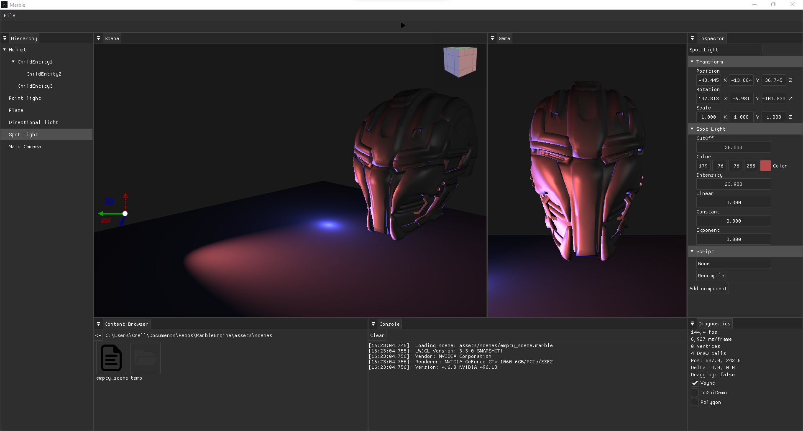
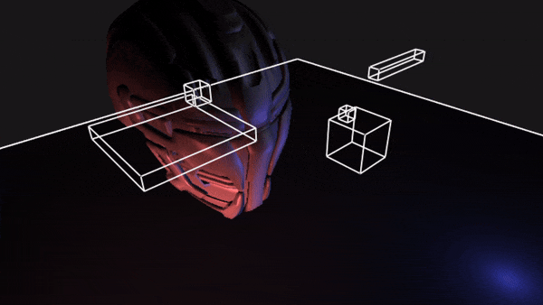

[![Contributors][contributors-shield]][contributors-url]
[![Forks][forks-shield]][forks-url]
[![Stargazers][stars-shield]][stars-url]
[![Issues][issues-shield]][issues-url]
[![MIT License][license-shield]][license-url]
[![LinkedIn][linkedin-shield]][linkedin-url]

<!-- PROJECT LOGO -->
 

  

<h3 align="center">Marble</h3>

  

    A game engine made in Java
     
    <a href="https://github.com/chrkj/Marble"><strong>Explore the docs »</strong></a>
     
     
    <a href="https://github.com/chrkj/Marble/issues">Report Bug</a>
    ·
    <a href="https://github.com/chrkj/Marble/issues">Request Feature</a>
  

<!-- ABOUT THE PROJECT -->
## About The Project
I created this project to learn about 2D/3D rendering by programming a simple game engine using the
[OpenGL](https://www.opengl.org//) rendering API. 

  

(<a href="#top">back to top</a>)

### Built With

Frameworks/libraries used for the project:

* [LWJGL](https://github.com/LWJGL/lwjgl3)
* [JOML](https://github.com/JOML-CI/JOML)
* [ImGui](https://github.com/SpaiR/imgui-java)
* [Obj](https://github.com/javagl/Obj)
* [JacksonYaml](https://github.com/FasterXML/jackson-dataformat-yaml)
* [PhysX](https://github.com/fabmax/physx-jni)

(<a href="#top">back to top</a>)

<!-- ROADMAP -->
## Roadmap

- 👷 2D/3D physics
- ⬜ Frustum culling
- ⬜ Forward+ rendering
- ⬜ Custom title bar
- ✅ Spot light
- ✅ Multiple lights in scenes
- ✅ Point light
- ✅ Directional light
- ✅ Custom layout theme
- ✅ Console panel
- ✅ Game / editor viewport
- ✅ Scene serialization / deserialization
- ✅ Entity gizmos
- ✅ Mouse picking

👷 *in development*

(<a href="#top">back to top</a>)

<!-- LICENSE -->
## License

Distributed under the MIT License. See `LICENSE.txt` for more information.

(<a href="#top">back to top</a>)

<!-- MARKDOWN LINKS & IMAGES -->
[contributors-shield]: https://img.shields.io/github/contributors/chrkj/Marble.svg?style=for-the-badge
[contributors-url]: https://github.com/chrkj/Marble/graphs/contributors

[forks-shield]: https://img.shields.io/github/forks/chrkj/Marble.svg?style=for-the-badge
[forks-url]: https://github.com/chrkj/Marble/network/members

[stars-shield]: https://img.shields.io/github/stars/chrkj/Marble.svg?style=for-the-badge
[stars-url]: https://github.com/chrkj/Marble/stargazers

[issues-shield]: https://img.shields.io/github/issues/chrkj/Marble.svg?style=for-the-badge
[issues-url]: https://github.com/chrkj/Marble/issues

[license-shield]: https://img.shields.io/github/license/chrkj/Marble.svg?style=for-the-badge&
[license-url]: https://github.com/chrkj/Marble/blob/master/LICENSE

[linkedin-shield]: https://img.shields.io/badge/-LinkedIn-black.svg?style=for-the-badge&logo=linkedin&colorB=555
[linkedin-url]: https://www.linkedin.com/in/christian-kjaer/

